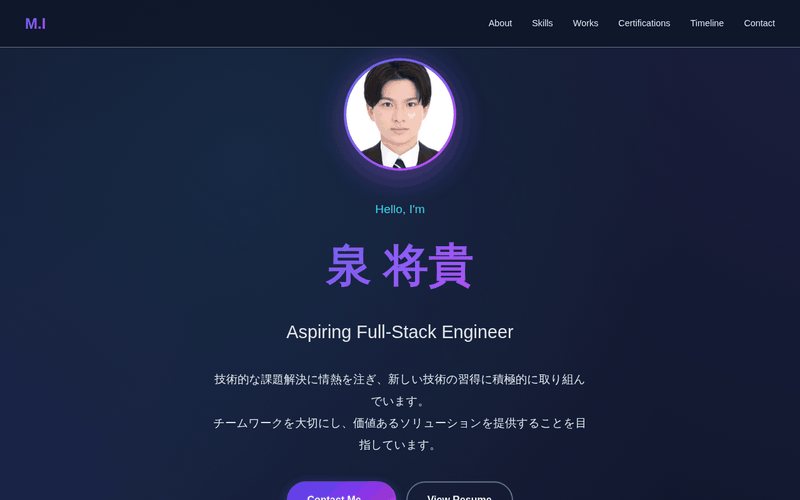
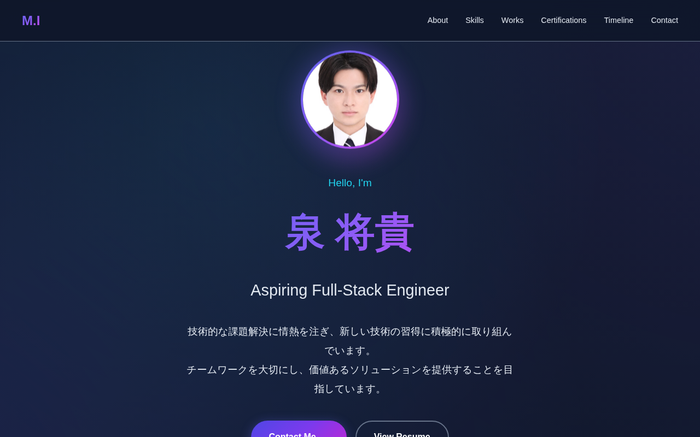
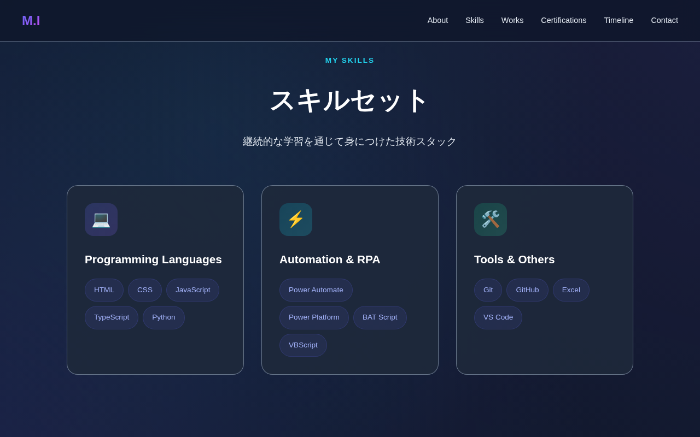
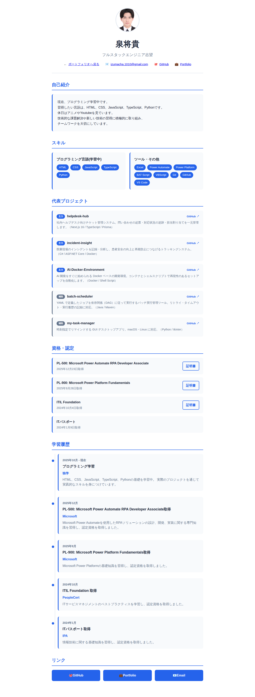
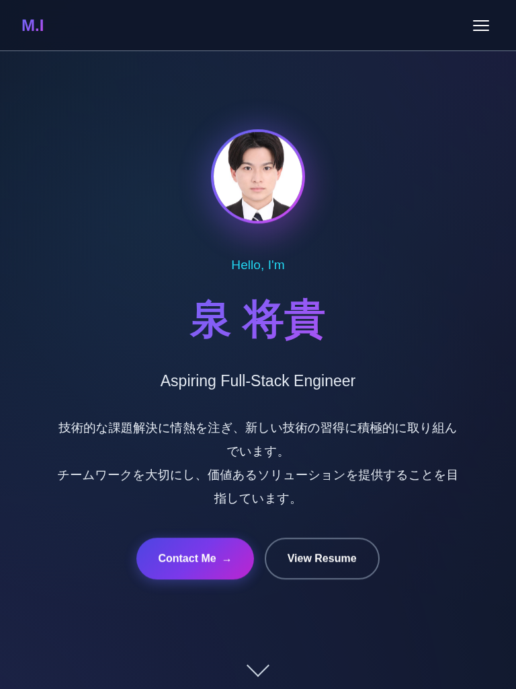

# Profile Portfolio

個人プロフィールページのポートフォリオサイトです。

## デモ

**公開デモ URL（GitHub Pages）**: https://izumacha.github.io/profile-portfolio/

- プロフィールページ（ダークテーマ）: [index.html](https://izumacha.github.io/profile-portfolio/)
- 職務経歴書（ライトテーマ・印刷対応）: [resume.html](https://izumacha.github.io/profile-portfolio/resume.html)



*デモ — ナビゲーションからのセクション遷移とスクロール連動アニメーション*

### 主要画面

| プロフィール（ファーストビュー） | スキルセット |
|---|---|
|  |  |

| 職務経歴書（ライトテーマ・ページ全体） | モバイル表示（768px） |
|---|---|
|  |  |

> スクリーンショットとデモ GIF は `npm run capture:screenshots` で自動撮影しています（[使用方法](#使用方法)を参照）。

## 特徴

- レスポンシブデザイン
- ダークテーマ
- モダンなUI/UXデザイン
- スキル、代表プロジェクト、活動履歴、リンクの表示

## 代表プロジェクト

評価いただく際は、まず以下の**主力プロジェクト 3 本**をご覧ください。補助プロジェクトは学習過程で取り組んだ作品です。

### 主力プロジェクト

| プロジェクト | 概要 | 主な技術 |
|---|---|---|
| [helpdesk-hub](https://github.com/izumacha/helpdesk-hub) | 社内ヘルプデスク向けチケット管理システム。起票から対応・SLA 期限監視・エスカレーション・ダッシュボード分析・FAQ 化までを一元管理し、対応漏れと属人化を防止。 | Next.js 15 / React 19 / TypeScript / Prisma 5 / PostgreSQL / Auth.js / Tailwind CSS v4 |
| [incident-insight](https://github.com/izumacha/incident-insight) | 医療現場のインシデント管理ツール。報告から 5 Whys による根本原因分析・再発防止策・効果評価まで PDCA を一気通貫で管理し、再発を自動検知。 | C# / ASP.NET Core 8 MVC / EF Core 8 / SQLite / Bootstrap 5 / Chart.js |
| [AI-Docker-Environment](https://github.com/izumacha/AI-Docker-Environment) | Claude Code を安全に動かすサンドボックス Docker 環境。iptables/ipset によるデフォルト拒否の egress 制限と認証情報の隔離でセキュリティを確保。 | Docker / Shell Script / iptables・ipset / GitHub Actions |

### 補助プロジェクト

| プロジェクト | 概要 | 主な技術 |
|---|---|---|
| [batch-scheduler](https://github.com/izumacha/batch-scheduler) | YAML で定義したジョブを依存関係（DAG）に従って実行する小さく堅牢なバッチ実行管理ツール。リトライ・タイムアウト・失敗時の依存スキップ・実行履歴の記録に対応。 | Java 21 / Maven 3.9+ / YAML |
| [my-task-manager](https://github.com/izumacha/my-task-manager) | 1 日のタスクを時間割のように時間軸へ配置するタイムライン型デスクトッププランナー。完了時点を起点に繰り返す「完了起点リピート」が特徴。 | Python 3.10+ / tkinter / Desktop App |

## 技術スタック

- HTML5
- CSS3
- レスポンシブデザイン

## 使用方法

1. `index.html` をブラウザで開く
2. ローカルサーバーで確認する場合は、以下のコマンドを実行：

```bash
# Python 3の場合
python -m http.server 8000

# Node.jsの場合（http-serverがインストールされている場合）
npx http-server
```

3. README 掲載用のスクリーンショット・デモ GIF を撮り直す場合：

```bash
npm ci                                      # 依存インストール（決定的）
npx playwright install --with-deps chromium # 初回のみ: 撮影用ブラウザ
npm run capture:screenshots                 # docs/screenshots/ を再生成（ffmpeg が必要）
```

GIF の生成に `ffmpeg` を使うため、事前にインストールしてください（例: `apt-get install ffmpeg` / `brew install ffmpeg`）。
ブラウザをダウンロードできない環境では、`CAPTURE_CHROMIUM_EXECUTABLE` に既存の Chromium 実行ファイルのパスを指定すると、そちらを使い回せます。

## カスタマイズ

- アバター画像のパスを変更
- 個人情報の更新
- スタイルの調整

## ライセンス

MIT License
